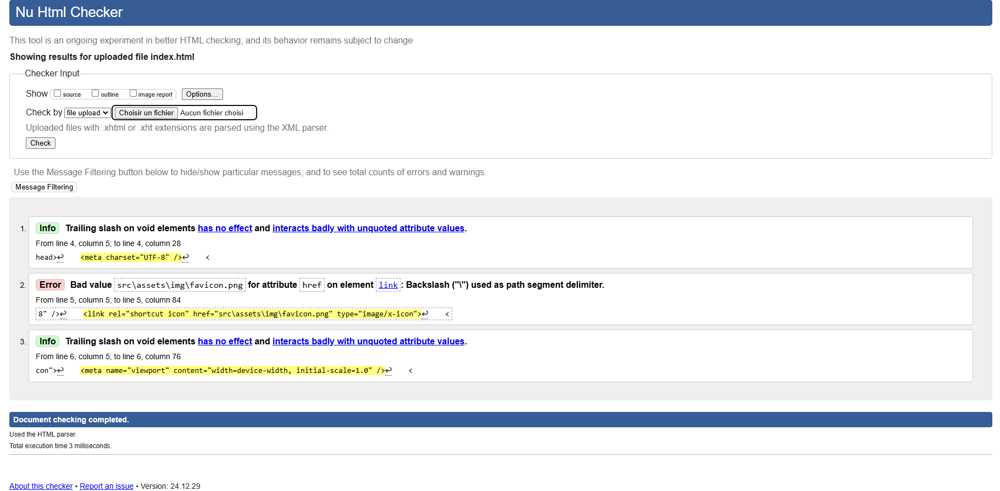
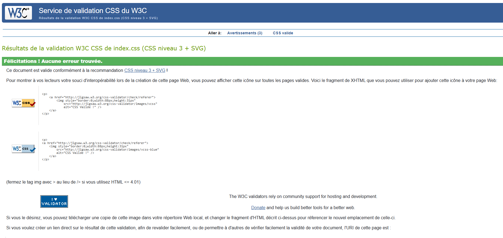

# Projet React - Portfolio de John Doe

## Description
Ce projet est un portfolio personnel développé avec React.js. Il présente les services, réalisations, articles de blog et informations de contact de John Doe. Le site est conçu pour être responsive et suit les bonnes pratiques de développement front-end.

## Fonctionnalités principales
- Navigation entre plusieurs pages :
  - Accueil
  - À propos
  - Services
  - Réalisations
  - Blog
  - Contact
  - Mentions légales
- Récupération des données depuis l'API GitHub de l'utilisateur.
- Responsive design avec un menu hamburger sur mobile.
- Effets interactifs au survol des boutons et des icônes.
- Footer contenant des informations importantes et des liens rapides.

## Prérequis
Avant de commencer, assurez-vous d'avoir les outils suivants installés sur votre machine :

- [Node.js](https://nodejs.org/) (version 14 ou plus récente)
- [npm](https://www.npmjs.com/) (ou [yarn](https://yarnpkg.com/))
- Un éditeur de texte tel que [VS Code](https://code.visualstudio.com/)

## Installation
1. Clonez le repository GitHub :
   ```bash
   git clone https://github.com/votre-utilisateur/votre-repository.git
   ```

2. Accédez au dossier du projet :
   ```bash
   cd votre-repository
   ```

3. Installez les dépendances nécessaires :
   ```bash
   npm install
   ```

## Lancement du projet
1. Démarrez le serveur de développement :
   ```bash
   npm start
   ```

2. Ouvrez votre navigateur et accédez à :
   ```
   http://localhost:3000
   ```

Le projet devrait maintenant être opérationnel sur votre navigateur.

## Déploiement
Pour créer une version optimisée du projet pour la production :
```bash
npm run build
```

Le dossier `build` contiendra les fichiers optimisés que vous pouvez déployer sur n'importe quel serveur web.

## Structure du projet
Voici une brève description de la structure du projet :

```
src/
├── components/          # Composants réutilisables
├── pages/               # Pages principales
├── assets/              # Images, icônes et fichiers statiques
├── App.js               # Composant principal
├── index.js             # Point d'entrée du projet
└── index.css            # Fichier CSS global
```

## Technologies utilisées
- **React.js** : Framework principal pour le développement de l'application.
- **Bootstrap** : Framework CSS pour la mise en page et les composants responsives.
- **Google Fonts** : Pour la police "Nunito Sans".

## Résultats des validations W3C
### Validation HTML


### Validation CSS



